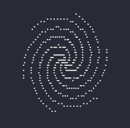

# flower-seeds

Use this game to draw a flower for your Valentine.




## Playing

flower-seeds draws sunflower seeds distribution pattern.
You can adjust the parameters with:

- <kbd>j</kbd>/<kbd>l</kbd> : the growth angle.
- <kbd>k</kbd>/<kbd>i</kbd> : the growth distance.
- <kbd>c</kbd>/<kbd>v</kbd> : the seed count.

Start by running [./flower-seeds.hs](flower-seeds.hs).
Your terminal needs to be at least 120x50.

The parameters are printed at the top of the screen.
You can pass them as program argument to redraw your best flower:

```ShellSession
./flower-seeds.hs "(11.0,5.0,47)"
```


## Documentation

This game is based on this video: [The Golden Ratio (why it is so irrational) - Numberphile](https://www.youtube.com/watch?v=sj8Sg8qnjOg).

Here is the less-minified version with type annotations:

```haskell
#!/usr/bin/env runhaskell
-- | flower-seeds expanded
-- Copyright 2023, Tristan de Cacqueray
-- SPDX-License-Identifier: CC-BY-4.0

-- | 'System.IO' to setup the terminal
import System.IO (stdin, hSetBuffering, BufferMode(NoBuffering))

-- | 'Control.Concurrent' for sleep
import Control.Concurrent (threadDelay)

-- | 'System.Environment' to get command line arguments
import System.Environment (getArgs)

type Flower =
  ( Float -- Angle
  , Float -- Distance
  , Int   -- Numbers
  )

-- | The initial params.
i :: Flower
i = (29.6, 3, 400)

-- | Generate the seed params.
g :: Flower -> [(Float, Float)]
g (a, d, n) = take n $ iterate (\(b, e) -> (b + pi * a/90, e + d/30)) (0,0)

-- | Get a seed coordinate.
c :: (Float, Float) -> (Int, Int)
c (a, d) = (round (60 + d*cos a), round (0.5*(50 + d*sin a)))

-- | Plant a seed.
p :: (Int, Int) -> IO ()
p (x, y) = do
  threadDelay 1000
  putStrLn ("\^[[" ++ show y ++ ";" ++ show x ++ "f❤")

-- | Render the flower.
r :: Flower -> IO [()]
r w = do
  putStrLn ("\^[cflower-seeds " <> show w)
  traverse p (map c (g w))

-- | Evaluate the user input.
e :: Flower -> Char -> IO ()
e (a, d, n) i =
  let b | i == 'j' = (-1)
        | i == 'l' = 1
        | o        = 0
      e | i == 'k' = (-1)
        | i == 'i' = 1
        | o        = 0
      m | i == 'c' = (-1)
        | i == 'v' = 1
        | o        = 0
  in go
      ( -- angle
        a + b/20
      , -- distance
        max 0.1 (d + e/10)
      , -- count
        max 1 (n + m*17)
      )

-- | The game loop.
go :: Flower -> IO ()
go w = do
  r w
  input <- getChar
  e w input

-- | Setup the terminal, parse the arguments and start the game.
main :: IO ()
main = do
  hSetBuffering stdin NoBuffering
  args <- getArgs
  case args of
    [] -> go i
    (x:_) -> go (read x)

-- | 'o' is used for minifying function guards to do tight if-then-else.
o :: Bool
o = True
```
